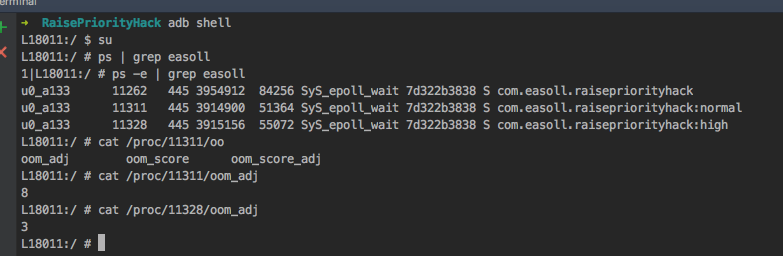

# RaisePriorityHack
A new way to raise you android process priority on all android version

在安卓7.0之前，提升进程优先级的方法已经有人介绍了。本方法适用安卓4.1~8.1版本，使用时只需调用
```
RaisePriorityHack.raisePriority()
```
在8.1上运行结果如下所示：
  

对原理感兴趣的可以阅读本文：
